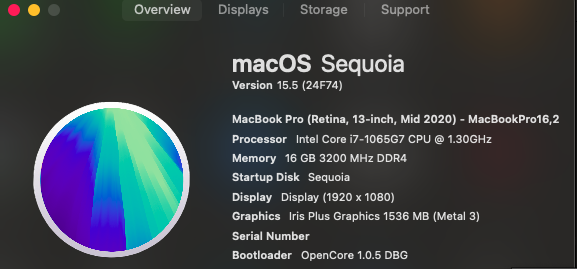

# Dell Vostro 5501 (Ice Lake) Hackintosh

(Compatible for Dell Inspiron 5401/5408/5501/5508 e Vostro 5401/5501, (i3 G1 - i5 G1 - i7 G7) these laptops use the same bios file)

### Computer Spec:

| Component        | Brank                              |
| ---------------- | ---------------------------------- |
| CPU              | Intel i7 1065G7 (4C-8T 8MB ICL)    |
| iGPU             | Intel® Iris Plus Graphics          |
| Lan              | Realtek 8168                       |
| Audio            | Realtek ALC236                     |
| Ram              | 16 GB DDR4 3200 Mhz                |
| Wifi + Bluetooth | Intel AX210 WIFI 6E                |
| NVMe             | HYNIX BC511 512 GB (WINDOWS)       |
| NVME             | SAMSUNG 970 EVO PLUS 500 GB (MACOS)|
| SmBios           | MacBookPro 16,2                    |
| BootLoader       | OpenCore                           |

### What works and What doesn't or WIP:

- [x] Intel Iris Plus iGPU eDP with Backlight Output
- [ ] Intel Iris Plus iGPU HDMI Output (Not supported at the moment)
- [ ] Intel Iris Plus iGPU Type-C to HDMI Output (Not supported at the moment)
- [x] Intel Iris Plus iGPU - H264 & HEVC
- [x] ALC236 Internal Speakers
- [x] ALC236 Internal microphone
- [x] ALC236 Combojack headphones
- [x] ALC236 Combojack microphone
- [ ] ALC236 HDMI Audio Output (Not supported at the moment)
- [ ] ALC236 TYPE-C to HDMI Audio Output (Not supported at the moment)
- [x] All USB-A 3.1 Ports (TYPE-C 3.2 Included)
- [x] SpeedStep / Sleep / Wake
- [x] HID Key PWRB & SLPB 
- [x] I2C Touchpad with gesture
- [x] Keyboard (PS2-Internal) with backlight
- [x] F6 & F7 Brightness Key
- [x] F10 Print Screen Key
- [x] F1 & F2 & F3 Sound Key
- [x] Wi-Fi and Bluetooth Intel AX200
- [x] Realtek RTL8168 LAN
- [x] SSD NVME Slot-1 PciE Gen3x4
- [x] SSD NVME Slot-2 PciE Gen3x4 
- [x] Micro SD Cardreader (USB-Internal)
- [x] WebCam (USB-Internal)
- [x] All Sensors CPU, IGPU, BATTERY, NVME, FAN
- [x] ACPI Battery
- [x] NVRAM (Native)
- [x] Recovery (macOS) boot from OpenCore
- [x] Windows 11 boot from OpenCore

## Peripherals & TouchPad Setting & Benchmarks

### Special Config:

- Usb port mapping performed
- SSDT-Hack
 

See [ioreg](./ioreg%20MacBook%20Pro%2016%2C2.ioreg) for more clarification

### MacOS bootable USB creation:
- Read the Dortania guide for creating your USB from Windows or macOS
- [Guide Dortania](https://dortania.github.io/OpenCore-Install-Guide/installer-guide/) - USB creation

## Bios settings for Bios Version 1.25.0
### Enable :
* SATA Operation : AHCI
* Fastboot : Thorough
* Integrated NIC : Enable

### Disable : 
* Secure Boot
* Absolute
* Intel SGX
* SMM Security Migration
* Wake on AC
* Wake on Dell USB-C Dock
* Power On Lid Open
* Enable UEFI Network Stack
* Sign Of Life : Early Logo Display / Early keyboard backlight
* cfg lock and DVMT: DO AT YOUR OWN RISK!!! It may brick your laptop.

 
 
 
Create a usb in FAT with MBR map and put [ru.efi](https://github.com/Lorys89/DELL_VOSTRO_5401-ICE-LAKE/raw/main/TOOLS%20EFI%20MOD/RU.efi) in it 
then go to the bios, and create an entry with the path of the usb and setting the ru.efi file and the name of 
your choice startup and then send and finally click apply.

Restart and press f12 among the entries you will have the last created, click any key, then click alt + ì a menu will appear and
scroll to CpuSetup and click enter, in the new screen go with the arrows on the value 0043 and change it from 01 to 00 and click 
enter and then ctrl + w to save and then alt + q to exit. proceed to check if your CFG LOCK is unlocked.

For the 2 DVMT values you have to go to the SaSetup menu and enter and look for 00A4 and set it from 02 to 05 and then move 
next to 00A5 and set from 02 to 03 then save with ctrl + w and to exit alt + q and you will have the suitable DVMT values to the igpu ice lake. 

### Working all NATIVE-SHORTCUTS-APPLE:

## Credits

- [Apple](https://apple.com) for macOS.

- [Acidanthera](https://github.com/acidanthera) for OpenCore and all the lovely hackintosh work.
